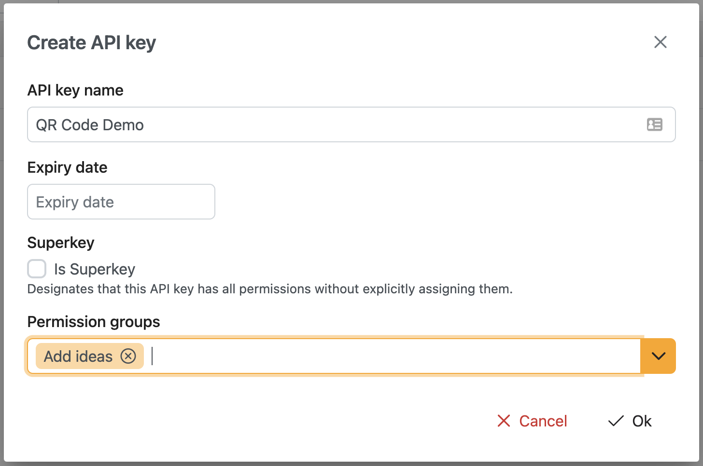

# Organization administration
Administration of the organization is done via Settings. Here, everything about the tenant can be configured.

## General
In the general tab, you can view and edit your own user account, as well as the organization details.

### Account
| Field | Description                     | Editable |
| ----- | ------------------------------- | -------- |
| Name  | First and last name of the user | Yes      |
| Email | Email address of the user       | No       |
| Roles | The roles of the current user   | No       |

### Organization
| Field              | Description                                                 | Editable |
| ------------------ | ----------------------------------------------------------- | -------- |
| Name               | Display name of the organization                            | Yes      |
| Owner              | The username of the owner of the organization               | No*      |
| Associated domains | The domain names that are associated with this organization | No*      |

*Contact customer support if you need to change this setting.

#### Owner
The owner of the organization has all the permissions within the tenant without explicitly assigning them. When a new organization is created, the owner can invite other users and assign roles to other users.

#### Associated domains
Domain names can be associated with the organization to allow users that have an email address on that domain to access the organization. This way, any user in your company sign up to Novodi and access the organization without explicitly inviting them. An organization can have multiple associated domains. Contact customer support to add or remove associated domains.

## Members
Manage the users that are part of the organization here. 

### Invite a user
To invite a new user, click the 'Invite user' button in the top right. Be aware that you need to have the 'User Manager' role in order to do so. A window will pop up where you can enter the email address of the user you would like to invite. If the user already has an account with Novodi, the user will be directly added to the organization. If the user does not have an account yet, it will receive an invitation email. After signing up, the user will have access to the organization.

### Assign user roles
To manage user roles, click the key button in the row of the user. Be aware that you need to have the 'User Manager' role to be able to manage user roles. After clicking the button, a window will pop up where you can use the drop down button to select the roles that the user should have. Remove a role by clicking the X. Hit Save to apply the changes. Hit Cancel to discard changes.

### Remove a user from the tenant
To remove a user from the organization, click the trash can icon.

## API Keys
API keys can be created to allow other applications to access Novodi data. 

### Create an API Key
To create an API key, use the 'New key' button on the API Key page. Fill in the form that pops up to create an API Key.

| Field                | Description                                                                                                                                                                                                                     |
| -------------------- | ------------------------------------------------------------------------------------------------------------------------------------------------------------------------------------------------------------------------------- |
| **Name**             | The name of the API Key                                                                                                                                                                                                         |
| **Expiry date**      | Leave blank for a non-expiring key. Choose a date to let the key expire                                                                                                                                                         |
| **Superkey**         | Select this option to give the key all the permissions as available in the Permission Groups. Please note this does not grant access to all the API functionalities, only the API endpoints that support API key authorization. |
| **Permisson Groups** | Select the permission groups this API Key should have access to. Please note that a permission group can have multiple underlying permissions. See the table below for more details on the permission groups.                   |

### API Key permission groups
The authorization level of an API key is defined by assigning permission groups to the API Key upon creation. 

| Permission group | Permission                                                   |
| ---------------- | ------------------------------------------------------------ |
| **Superkey**     | The key grants access to all the available permission groups |
| **Add Ideas**    | Add new ideas                                                |

### Generate QR Code
When an API Key with the 'Add ideas' permission is created, you have the option to generate a QR code that users can scan to submit an idea. See [QR Code Idea Submission](/idea_management_ideas/#qr-code-idea-submission) for more info about this function. 

To generate a QR code, create an API Key with the 'Add ideas' permission. 

Click 'Ok' to create the API key. When the API Key is created, click 'Create QR Code' to generate the QR Code. The image download should start automatically. Click the QR code to download the image again.
