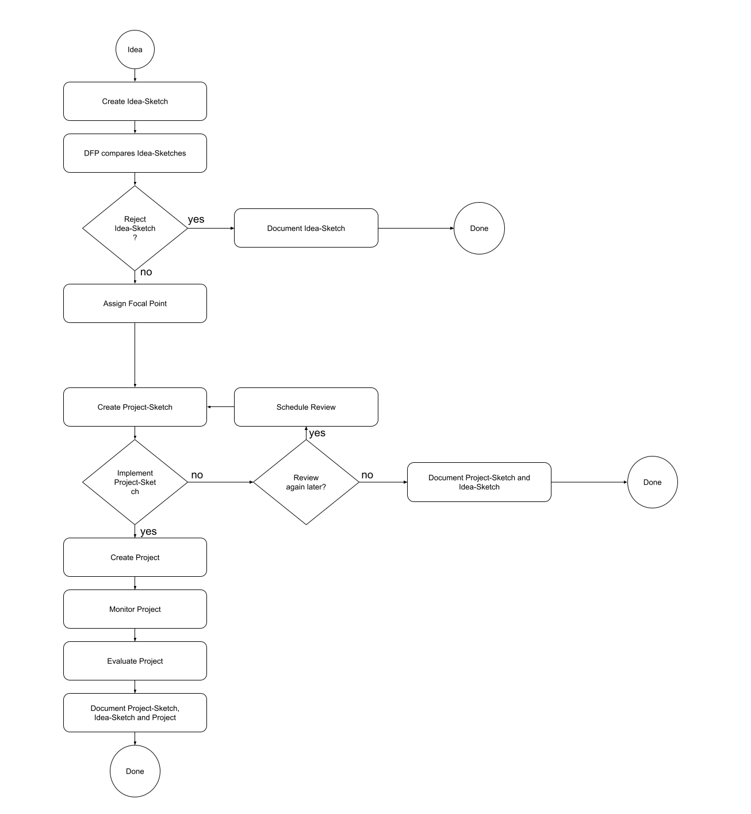

# Idea Management Concept

## Idea Management as Flow Chart

## Effort vs Impact

The essence of idea management is to minimize the effort while maximazing the positive impact or upside for the organisation.

Any idea which comes up in an organisation has an unknown upside which makes it difficult to allocate time and money to investigate the potential upside or even implement the idea as a project but should be further evaluted to make sure that a significant upside is not lost for the organisation.

Implementing a project requires a lot of effort and therefore the upside and costs of an idea as project should be very clear.

This is where project sketches come in as a stage which requires a little effort but gives a good enough estimate of the costs and upside of a possible project based on the idea.

With this degree of certainty and in comparison to other project sketches, an organisation can prioritise, schedule and implement projects

With the project advancing, changes to costs and upside can me tracked and used to re-evaluate prioritisation but especially to improve the skill of a team or organisation to collect ideas at scale, derive a strategy from project sketches and efficiently implement projects - this empowers the team or organisation to own their own innovation and (digital) transformation.
