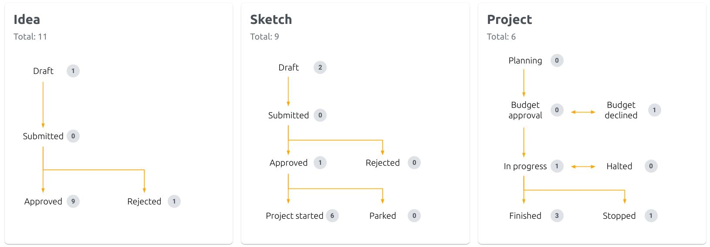

# Dashboard

The Dashboard Overview allows the User to oversee the entire Idea management flow. It also indicates how many Ideas, Sketches and Projects are in their respective stage.

Learn more about the stages in the [Concept article](idea_management_concept.md).
